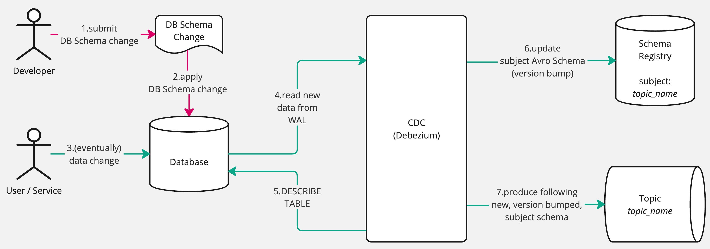
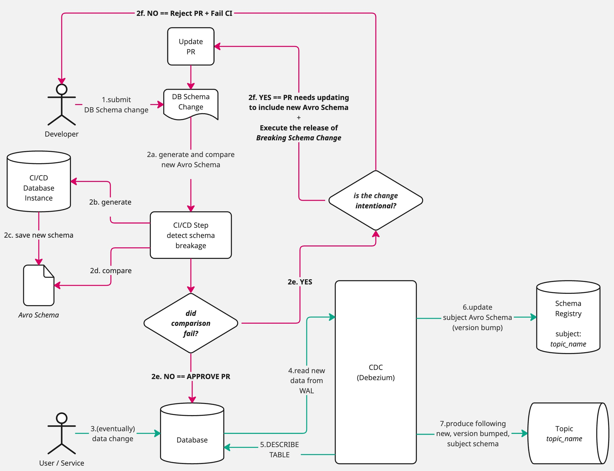

[](https://github.com/snyk/skemium/actions/workflows/ci.yaml)
[](https://github.com/snyk/skemium/actions/workflows/release-uberjar.yaml)
[](https://github.com/snyk/skemium/actions/workflows/release-binaries.yaml)

# Skemium

Generate and Compare [Debezium] Change Data Capture ([CDC]) [Avro] Schema.

Leveraging [Debezium] and [Schema Registry] own codebases, each Table of a Database is mapped to 3 components:

* _Key_ [Avro] schema: describes the `PRIMARY KEY` of the Table - `NULL` if not set
* _Value_ [Avro] schema: describes each Row of the Table
* _Envelope_ [Avro] schema: wrapper for the _Value_, used by Debezium to realize [CDC] when Producing to a Topic

[Debezium CDC Source Connector] uses the _Key_ and the _Envelope_ schemas when producing to a Topic:
the former is used for the [Message _Key_][Kafka Message Key], the latter for the Message _Payload_.

**Skemium** leverages those schemas to compare between evolutions of the originating Database Schema,
and identifies compatibility issues executing the comparison logic implemented by [Schema Registry].

**If you make changes to your Database Schema, and want to know if it's going to break your Debezium CDC production,
`skemium` is the tool for you.**

# Background

In our experience, the way [Debezium] works can catch users off guard in 2 major ways:

1. Making changes to the _source_ Database Schema in ways that break [Schema Compatibility]
2. Non-zero amount of time between making changes to the _source_ Database Schema, and that change being _captured_
   by Debezium and published to [Schema Registry]

**Avoiding the first is made much harder by the second!**

## Delayed schema publishing

There is sometimes confusion between “making a DB Schema” vs “making a [Schema Registry] Schema” change:

* the former happen when developers apply changes to their RDBMS: usually, before their application code start relying on the new schema
* the latter happens when data is actually updated into one of the changed tables:
  1. Debezium detects it (reading the [RDBMS WAL] and the `DESCRIBE TABLE` command)
  2. Debezium's `Producer` attempts to create a new Schema version for the associated [schema subject]
     1. _either_ fails if the change violates the configured [Schema Compatibility]
     2. _or_ succeeds in publishing a new version for the [schema subject] creation was successful
  3. Debezium's `Producer` resumes producing to the related Kafka Topic

When 2.1. above happens, Debezium stops producing and in turns stops consuming the [RDBMS WAL]:

1. Traffic from the RDBMS to Kafka halts (bad!)
2. RDBMS storage fills up, as the WAL is not getting flushed (worse!)



## The role of `skemium`

Skemium's primary objective is to target this issue and empower developers to instrument their CI process
to detect a _breakage_ of a [CDC] [schema subject] **as early as possible**.

Ideally, when a PR is submitted and before any RDBMS schema has been changed in production, it should be possible to:

* spin up a local instance of the RDBMS
* apply the latest _desired_ DB Schema
* execute `skemium generate` to obtain the corresponding Avro Schemas
  (i.e. what would eventually land in [Schema Registry])
* execute `skemium compare` to compare an existing copy of the Avro Schemas,
  with the new one, applying the desired [Schema Compatibility]



## What if a **_Breaking Schema Change_** is necessary?

Sometimes is going to be inevitable: you _need_ to make a change in your Database Schema,
and a new version of the [schema subject] must be released - a version that breaks [Schema Compatibility].

This is beyond the scope of Skemium (for now?), but in those situations
what you _can_ do is something along the lines of:

* Make a coordinated plan with Consumer Services of the [CDC] Topic
* Temporarily disable [Schema Compatibility] in [Schema Registry]
* Let [Debezium] publish a new [schema subject] version
* Restore [Schema Compatibility]

The details will depend on your specific circumstances, and your mileage may vary `¯\_(ツ)_/¯`.

## Generating the _correct_ Avro Schema

Skemium **does not** implement its own schema extraction or serialization logic: it relies instead on the source code
of [Debezium] and [Schema Registry]. Specifically, the following 2 packages do the bulk of the work:

```xml
<!-- https://mvnrepository.com/artifact/io.debezium/debezium-core -->
<dependency>
  <groupId>io.debezium</groupId>
  <artifactId>debezium-core</artifactId>
  <version>${ver.debezium}</version>
</dependency>
<!-- https://mvnrepository.com/artifact/io.confluent/kafka-connect-avro-converter -->
<dependency>
  <groupId>io.confluent</groupId>
  <artifactId>kafka-connect-avro-converter</artifactId>
  <version>${ver.kafka-connect-avro-converter}</version>
</dependency>
```

To dig deeper, please look at the [`pom.xml`](./pom.xml).

### Key classes "borrowed"

Skemium design brings together [Debezium][Debezium source code] and
[Schema Registry][Schema Registry source code] codebases, using the Apache [Avro] codebase as _lingua franca_:

* `TableSchemaFetcher` extracts a `List<io.debezium.relational.TableSchema>`, using the Debezium's
  RDBMS-specific connector source code to connect and query the DB schema
* A `TableAvroSchemas` is created for each `io.debezium.relational.TableSchema`, invoking the provided methods
  that extract _Key_, _Value_ and _Envelope_ as `org.apache.kafka.connect.data.Schema`
* Each `org.apache.kafka.connect.data.Schema` is converted to `io.confluent.kafka.schemaregistry.avro.AvroSchema` via
  the provided constructor
* `io.confluent.kafka.schemaregistry.CompatibilityChecker` is used to compare current and next
  versions of `io.confluent.kafka.schemaregistry.avro.AvroSchema`,
  applying the desired `io.confluent.kafka.schemaregistry.CompatibilityLevel`

This gives us confidence that the generation of the Avro Schema, as well as the compatibility check, are the exact
same that Debezium will apply in production.

# Usage

## Binaries

Skemium can be [compiled from source](#development), but for convenience we
[release binaries](https://github.com/snyk/skemium/releases):

* `skemium-${VER}-jar-with-dependencies`:
  an [_uber jar_](https://support.sonatype.com/hc/en-us/articles/28958118202131-What-is-an-uber-jar),
  easy to use in an environment where a JRE is present
* `skemium-${VER}-${OS}-${ARCH}`: native binary, generated via [GraalVM] (see [below](#package-native-binary))

All binaries are generated when a new _tag_ is pushed to the `main` branch.

## `generate` command

The `generate` command connects to a Database, reads its _Database Schema_ and coverts it to a [CDC] _Avro Schema_,
using [Debezium Avro Serialization].

The output is saved in a user given _output directory_. The directory will contain:

* For each Table, a set of files following the naming structure `DB_NAME.DB_SCHEMA.DB_TABLE.EXTENSION`
  * _Table Key_ schema file (`EXTENSION = .key.avsc`)
  * _Table Value_ schema file (`EXTENSION = .val.avsc`)
  * _Table Envelope_ schema file (`EXTENSION = .env.avsc`)
  * The checksum of all 3 schema files above (`EXTENSION = .sha256`)
* A metadata file named `.skemium.meta.json` ([schema](#generated-avro-schemas-metadata-file))

For example, if the database `example` contains 2 tables `user` and `address` in the database schema `public`, the output
directory will look like:

```shell
$ tree example_schma_dir/

example_schma_dir/
├── .skemium.meta.json
├── example.public.address.env.avsc
├── example.public.address.key.avsc
├── example.public.address.sha256
├── example.public.address.val.avsc
├── example.public.user.env.avsc
├── example.public.user.key.avsc
├── example.public.user.sha256
└── example.public.user.val.avsc
```

### Help

<details>
<summary>Run `skemium help generate` for usage instructions</summary>

```shell
$ skemium help generate

Generates Avro Schema from Tables in a Database

skemium generate [-v] -d=<dbName> -h=<hostname> [--kind=<kind>] -p=<port> --password=<password> -u=<username> [-s=<dbSchemas>[,
                 <dbSchemas>...]]... [-t=<dbTables>[,<dbTables>...]]... [-x=<dbExcludedColumns>[,<dbExcludedColumns>...]]... [DIRECTORY_PATH]

Description:

Connects to Database, finds schemas and tables,
converts table schemas to Avro Schemas, stores them in a directory.

Parameters:
      [DIRECTORY_PATH]        Output directory
                                Default: skemium-20250610-161400

Options:
  -d, --database=<dbName>     Database name (env: DB_NAME)
  -h, --hostname=<hostname>   Database hostname (env: DB_HOSTNAME)
      --kind=<kind>           Database kind (env: DB_KIND - optional)
                                Values: POSTGRES
                                Default: POSTGRES
  -p, --port=<port>           Database port (env: DB_PORT)
      --password=<password>   Database password (env: DB_PASSWORD)
  -s, --schema=<dbSchemas>[,<dbSchemas>...]
                              Database schema(s); all if omitted (env: DB_SCHEMA - optional)
  -t, --table=<dbTables>[,<dbTables>...]
                              Database table(s); all if omitted (fmt: DB_SCHEMA.DB_TABLE|DB_TABLE - env: DB_TABLE - optional)
  -u, --username=<username>   Database username (env: DB_USERNAME)
  -v, --verbose               Logging Verbosity - use multiple -v to increase (default: ERROR)
  -x, --exclude-column=<dbExcludedColumns>[,<dbExcludedColumns>...]
                              Database table column(s) to exclude (fmt: DB_SCHEMA.DB_TABLE.DB_COLUMN - env: DB_EXCLUDED_COLUMN - optional)
```
</details>

### Filtering parts of the Database Schema

`generate` offers options to filter parts of the Database Schema:

* `-s | --schema`: only include selected schema(s) in the output
  * Format: `-s DB_SCHEMA`
  * Cardinality: `1..*`, either repeat option OR use comma (`,`) separator
* `-t | --table`: only include selected table(s) in the output
  * Format: `-t DB_TABLE` or `-t DB_SCHEMA.DB_TABLE`
  * Cardinality: `1..*`, either repeat option OR use comma (`,`) separator
  * Specificity:
    * `DB_TABLE`: includes all tables of that name, across all selected schemas
    * `DB_SCHEMA.DB_TABLE` includes only a table of that name, in the specific schema
* `-x | --exclude-column`: exclude selected column(s) from the output
  * Format: `-x DB_SCHEMA.DB_TABLE.DB_COLUMN`
  * Cardinality: `1..*`, either repeat option OR use comma (`,`) separator

Where:

* `DB_SCHEMA` is the name of a schema defined in the database (e.g. `public`)
* `DB_TABLE` is the name of a table in the database
* `DB_COLUMN` is the name of a column in the database

## `compare` command

The `compare` command takes 2 directories (created via `generate`) containing the [CDC] _Avro Schema_ of a Database,
and compares them applying the given [Schema Compatibility] type.
The directories are identified as _`CURRENT`_ and _`NEXT`_:

* `CURRENT`: [CDC] Avro Schema of a Database, generated at time `T`
* `NEXT`: [CDC] Avro Schema of the Database, generated at time `T+1`

`compare` executes a table-by-table [Schema Compatibility] check, and reports on the result.
Exit Code will be `0` in case of success, `1` otherwise.

### Schema changes and CI mode

The `compare` command reports (via `WARN` logging) if discrepancies are detected between `CURRENT` and `NEXT`:

1. **Table additions/removals**: When tables are added or removed between the two schema directories
2. **Schema modifications**: When existing table schemas are modified (even if the changes are compatible)

The flag `--ci-mode` can be used to _force_ a failure in case of **any** schema changes:

* **Table discrepancies**: Additions or removals of tables
* **Schema changes**: Modifications to existing table schemas (key, value, or envelope schemas)

**This enhanced CI mode is ideally used in CI/CD automations** to ensure that:

* Engineers are forced to acknowledge schema changes by updating their schema copies
* All schema modifications are tracked and reviewed, even if they are compatible
* Schema drift is prevented by requiring explicit acknowledgment of changes

#### CI Mode Behavior

| Scenario                    | Normal Mode                | CI Mode    |
| --------------------------- | -------------------------- | ---------- |
| No changes                  | ✅ Success                 | ✅ Success |
| Compatible schema changes   | ✅ Success (with warnings) | ❌ Failure |
| Incompatible schema changes | ❌ Failure                 | ❌ Failure |
| Table additions/removals    | ✅ Success (with warnings) | ❌ Failure |

### JSON output

If necessary, the output of `compare` can be stored in a output JSON file, using the `--output` option ([schema](#avro-schemas-comparison-result)).

### Help

<details>
<summary>Run `skemium help compare` for usage instructions</summary>

```shell
$ skemium help compare

Compares Avro Schemas generated from Tables in a Database

skemium compare [-iv] [-c=<compatibilityLevel>] [-o=<output>] CURR_SCHEMAS_DIR NEXT_SCHEMAS_DIR

Description:

Given 2 directories (CURRENT / NEXT) containing Avro Schemas of Database Tables,
compares them according to Compatibility Level.

Parameters:
      CURR_SCHEMAS_DIR    Directory with the CURRENT Database Table schemas
      NEXT_SCHEMAS_DIR    Directory with the NEXT Database Table schemas

Options:
  -c, --compatibility=<compatibilityLevel>
                          Compatibility Level (env: COMPATIBILITY - optional)
                          See: https://docs.confluent.io/platform/current/schema-registry/fundamentals/schema-evolution.html
                            Values: NONE, BACKWARD, BACKWARD_TRANSITIVE, FORWARD, FORWARD_TRANSITIVE, FULL, FULL_TRANSITIVE
                            Default: BACKWARD
  -i, --ci, --ci-mode     CI mode - Fail when schema changes are detected (table additions/removals or schema modifications) (env: CI_MODE - optional)
                            Default: false
  -o, --output=<output>   Output file (JSON); overridden if exists (env: OUTPUT_FILE - optional)
  -v, --verbose           Logging Verbosity - use multiple -v to increase (default: ERROR)
```
</details>

## `compare-files` command

The `compare-files` command compares two individual Avro Schema files (`.avsc`) directly, without requiring them to be part of a database-generated schema directory. This is useful for comparing bespoke or custom Avro schemas.

The command takes 2 Avro schema files and compares them applying the given [Schema Compatibility] type:

* `CURR_SCHEMA_FILE`: The current version of the Avro schema file
* `NEXT_SCHEMA_FILE`: The next version of the Avro schema file

`compare-files` executes a [Schema Compatibility] check and reports on the result.
Exit Code will be `0` in case of success, `1` otherwise.

### CI mode for file comparison

Similar to the `compare` command, `compare-files` supports a `--ci-mode` flag that will force a failure when any schema changes are detected, even if they are compatible. This ensures that all schema modifications are explicitly acknowledged.

### JSON output

The output of `compare-files` can be stored in a JSON file using the `--output` option ([schema](#schema-file-comparison-result)).

### Help

<details>
<summary>Run `skemium help compare-files` for usage instructions</summary>

```shell
$ skemium help compare-files

Compares two Avro Schema (.avsc) files

skemium compare-files [-iv] [-c=<compatibilityLevel>] [-o=<output>] CURR_SCHEMA_FILE NEXT_SCHEMA_FILE

Description:

Given 2 Avro Schema files (.avsc), compares them according to the specified Compatibility Level.
This command is designed for comparing bespoke/custom Avro schemas that are not generated from database tables.

Parameters:
      CURR_SCHEMA_FILE    Path to the CURRENT Avro schema file (.avsc)
      NEXT_SCHEMA_FILE    Path to the NEXT Avro schema file (.avsc)

Options:
  -c, --compatibility=<compatibilityLevel>
                          Compatibility Level (env: COMPATIBILITY - optional)
                          See: https://docs.confluent.io/platform/current/schema-registry/fundamentals/schema-evolution.html
                            Values: NONE, BACKWARD, BACKWARD_TRANSITIVE, FORWARD, FORWARD_TRANSITIVE, FULL, FULL_TRANSITIVE
                            Default: BACKWARD
  -i, --ci, --ci-mode     CI mode - Fail when schema changes are detected (env: CI_MODE - optional)
                            Default: false
  -o, --output=<output>   Output file (JSON); overridden if exists (env: OUTPUT_FILE - optional)
  -v, --verbose           Logging Verbosity - use multiple -v to increase (default: ERROR)
```
</details>

## Logging verbosity

The option `-v | --verbose` (availabel for all commands) controls the logging verbosity.
By default, the logging level is `ERROR`.
But it can be increased by passing one or more `-v` options, to a maximum level of `TRACE`. The mapping is:

```
<none>    -> ERROR
-v        -> WARN
-vv       -> INFO
-vvv      -> DEBUG
-vvvv     -> TRACE
-vvvvv... -> TRACE
```

## Skemium's schemas

In a _kinda_ meta twist, Skemium command outputs _also_ have their own schemas.

### Generated Avro Schemas metadata file

The output of the command `generate` includes the _metadata_ file `.skemium.meta.json`.
This summarises the output of the command, information about the moment in time, the local repository, and more.

The schema for this file is at [<prj_root>/schemas/skemium.generate.meta.avsc](./schemas/skemium.generate.meta.avsc).

### Avro Schemas comparison result

The `compare` command can optionally save the result to an `--output` file.
This summarises what was compared, what [Schema Compatibility] was applied,
and what issues (if any) were identified by the comparison.

The schema for this file is at [<prj_root>/schemas/skemium.compare.result.avsc](./schemas/skemium.compare.result.avsc).

### Schema file comparison result

The `compare-files` command can optionally save the result to an `--output` file.
This summarises the two schema files that were compared, what [Schema Compatibility] was applied,
and what incompatibilities (if any) were identified.

The schema for this file is at [<prj_root>/schemas/skemium.compare-files.result.avsc](./schemas/skemium.compare-files.result.avsc).

# Interested in contributing?

Here are some major features that we haven't had time to tackle yet:

* [ ] Support for additional Databases (MySQL, MariaDB, MongoDB, Oracle, SQL Server, ...): currently only PostgreSQL is supported
* [ ] Support connecting to GCP CloudSQL databases via
  [dedicated `SocketFactory`](https://github.com/GoogleCloudPlatform/cloud-sql-jdbc-socket-factory)
* [ ] Support custom key definition for a table, similar to what
  [`message.key.columns`](https://debezium.io/documentation/reference/stable/connectors/postgresql.html#postgresql-property-message-key-columns)
  allows when configuring Debezium. This is useful when an arbitrary key is desired or the table is missing a primary key.
* [ ] Support for _generating_ and _comparing_ [JSON Schema]
* [ ] Support for _generating_ and _comparing_ [Protobuf] schemas

Of course, small contributions and bugfixes are also _very_ welcome.

# Development

## Requirements

* Maven 3.9+
* JDK 21+

We recommend using [asdf] to setup your local development, as it makes it very easy to get set up:

```shell
asdf install
```

## Build & Test

```shell
$ mvn clean package
```

### Package Uber-JAR

```shell
$ mvn clean package assembly:single -DskipTests
```

### Package Native Binary

> [!NOTE]
> For this option, you need to use [GraalVM]. If you are using [asdf], edit the `.tools-versions` file and uncomment
> the line to switch on `oracle-graalvm`; then, `asdf install`.

```shell
$ mvn clean package native:compile-no-fork -DskipTests
```

#### GraalVM `native-image` and choosing a machine type

[`native-image`][native-image] is what [GraalVM] uses to compiles Java code into native executables.
The default options used by `native-image` are OK, but one determines the exact set of CPU features the compilation
happens against: `-march`
(documented in the [`native-image` build options](https://www.graalvm.org/latest/reference-manual/native-image/overview/Options/#build-options)).

<details>
<summary>Output of `-march=list` on `x86_64`</summary>

```shell
On AMD64, the following machine types are available:

'compatibility'
  CPU features: all of 'x86-64'
'haswell'
  CPU features: all of 'x86-64' + SSE3 + SSSE3 + SSE4_1 + SSE4_2 + POPCNT + LZCNT + AVX + AVX2 + AES + CLMUL + BMI1 + BMI2 + FMA
'native'
  CPU features: CX8 + CMOV + FXSR + HT + MMX + AMD_3DNOW_PREFETCH + SSE + SSE2 + SSE3 + SSSE3 + SSE4A + SSE4_1 + SSE4_2 + POPCNT + LZCNT + TSC + TSCINV_BIT + AVX + AVX2 + AES + ERMS + CLMUL + BMI1 + BMI2 + ADX + SHA + FMA + VZEROUPPER + FLUSH + FLUSHOPT + HV + RDTSCP + RDPID + FSRM + F16C + CET_SS
'skylake'
  CPU features: all of 'haswell' + AMD_3DNOW_PREFETCH + ADX + FLUSHOPT
'skylake-avx512'
  CPU features: all of 'skylake' + AVX512F + AVX512DQ + AVX512CD + AVX512BW + AVX512VL + CLWB
'x86-64'
  CPU features: CX8 + CMOV + FXSR + MMX + SSE + SSE2
'x86-64-v1'
  CPU features: all of 'x86-64'
'x86-64-v2'
  CPU features: all of 'x86-64-v1' + SSE3 + SSSE3 + SSE4_1 + SSE4_2 + POPCNT
'x86-64-v3'
  CPU features: all of 'x86-64-v2' + LZCNT + AVX + AVX2 + BMI1 + BMI2 + FMA
'x86-64-v4'
  CPU features: all of 'x86-64-v3' + AVX512F + AVX512DQ + AVX512CD + AVX512BW + AVX512VL
```
</details>

<details>
<summary>Output of `-march=list` on `aarch64_64`</summary>

```shell
On AArch64, the following machine types are available:

'armv8-a'
  CPU features: FP + ASIMD
'armv8.1-a'
  CPU features: all of 'armv8-a' + CRC32 + LSE
'compatibility'
  CPU features: all of 'armv8-a'
'native'
  CPU features: FP + ASIMD + EVTSTRM + AES + PMULL + SHA1 + SHA2 + CRC32 + LSE + DCPOP + SHA3 + SHA512 + SVE + PACA + SVEBITPERM + SVE2


The option also supports one or more feature modifiers via the form '-march=arch{+[no]feature}*'. Example: 'armv8.1-a+lse' enables Large System Extension instructions.
The following feature modifiers are available: 'aes', 'lse', 'fp', 'simd'.
```
</details>

After a bit of experimentation, we determined that `-march=compatibility` was the best choice.

## Taskfile (optional)

If you have taken advantage of the [asdf] setup (i.e. `asdf install`), you have already installed https://taskfile.dev/.
Most frequently used _tasks_ are already configured in the [Taskfile](./Taskfile.yml). Give it a go!

## Cutting a new release

The CI is setup to create a new release when a new tag in the format `vX.Y.Z` is pushed to the repository.
We use [gh-release] to handle most of the process (see [.github/workflows/release-*.yaml](./.github/workflows) for details),
and the only manual step is to:

1. ensure all PRs we aim to merge and release are merged
2. figure out what the next version should be, by following [Semantic Versioning] principles: e.g. `$NEXT_VERSION`
3. tag `main` with the new version: `task tag-version -- $NEXT_VERSION`
4. push the new tag to the `main` branch of the repo: `git push --tags`
5. Go to https://github.com/snyk/skemium/actions and confirm the release process has started

# Credits

As any open source tool, this builds on the shoulders of the great work of others (see the [pom.xml](./pom.xml)).

But I want to especially thank 2 projects for the _core_ of the functionality:
  * [Debezium], providing logic to extract database table schemas
  * Confluent [Schema Registry], providing logic to convert to/from Avro Schemas

# License

[Apache 2.0](./LICENSE)

---

**Made with 💜 by Snyk**

[Avro]: https://avro.apache.org/
[CDC]: https://en.wikipedia.org/wiki/Change_data_capture
[CI]: https://www.atlassian.com/continuous-delivery/continuous-integration
[Debezium Avro Serialization]: https://debezium.io/documentation/reference/stable/configuration/avro.html
[Debezium CDC Source Connector]: https://debezium.io/documentation/reference/stable/connectors/index.html
[Debezium source code]: https://github.com/debezium/debezium
[Debezium]: https://debezium.io/
[GraalVM]: https://www.graalvm.org/
[JSON Schema]: https://json-schema.org/
[Kafka Message Key]: https://www.confluent.io/learn/kafka-message-key/
[Protobuf]: https://protobuf.dev/
[RDBMS WAL]: https://debezium.io/documentation/reference/stable/connectors/postgresql.html#how-the-postgresql-connector-works
[Schema Compatibility]: https://docs.confluent.io/platform/current/schema-registry/fundamentals/schema-evolution.html#compatibility-types
[Schema Registry source code]: https://github.com/confluentinc/schema-registry
[Schema Registry]: https://docs.confluent.io/platform/6.2/schema-registry/index.html
[Semantic Versioning]: https://semver.org/
[asdf]: https://asdf-vm.com/
[gh-release]: https://github.com/softprops/action-gh-release
[native-image]: https://www.graalvm.org/latest/reference-manual/native-image/
[schema subject]: https://developer.confluent.io/courses/schema-registry/schema-subjects/
